# Lab8Web

# Lab7Web

### Nurul Fajri - 312110506

### TI.21.C.1

## PHP FRAMEWORK (CODEIGNITER)

## LANGKAH LANGKAH PRAKTIKUM

Buka XAMPP,pada bagian Apache klik Config (PHP.ini)'
'

Pada bagian extention, hilangkan tanda ; (titik koma) pada ekstensi yang akan diaktifkan.'
'
Kemudian simpan kembali filenya dan restart Apache web server.'
'
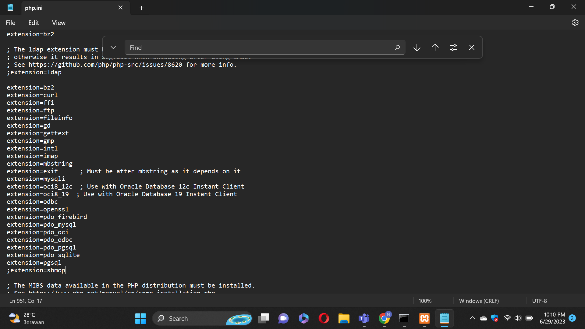

•Unduh CODEIGNITER 4 '
'
•Extrak file zip Codeigniter ke direktori htdocs/.'
'
• Ubah nama direktory framework-4.x.xx menjadi ci4. '
'
• Buka browser dengan alamat http://localhost/lab11_ci/ci4/public/ '
'
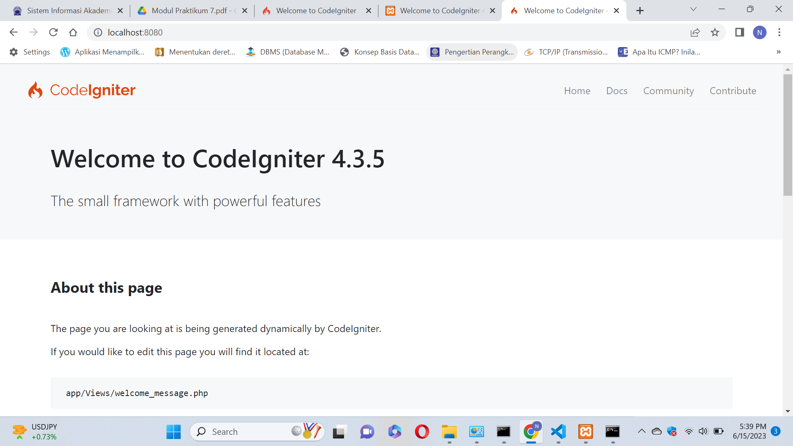

Buka CMD lalu arahkan lokasi direktori sesuai dengan direktori kerja project yang dibuat 
Perintah untuk memanggil CLI CODEIGNITER adalah'
'
php spark'
'
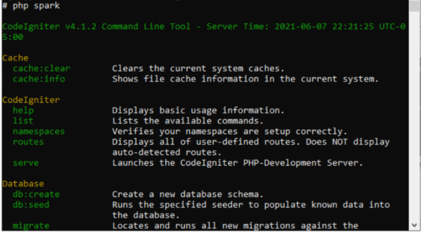

Mengaktifkan Mode Debugging '
'
Codeigniter 4 menyediakan fitur debugging untuk memudahkan developer untuk mengetahui pesan
error apabila terjadi kesalahan dalam membuat kode program.'
'
Secara default fitur ini belum aktif. Ketika terjadi error pada aplikasi akan ditampilkan pesan
kesalahan seperti berikut.'
'
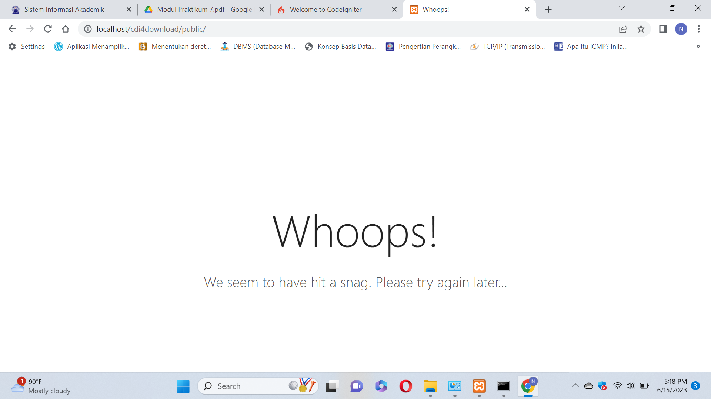

Ubah nama file env menjadi .env kemudian buka file tersebut dan ubah nilai variabel CI_ENVIRINMENT menjadi development.'
'
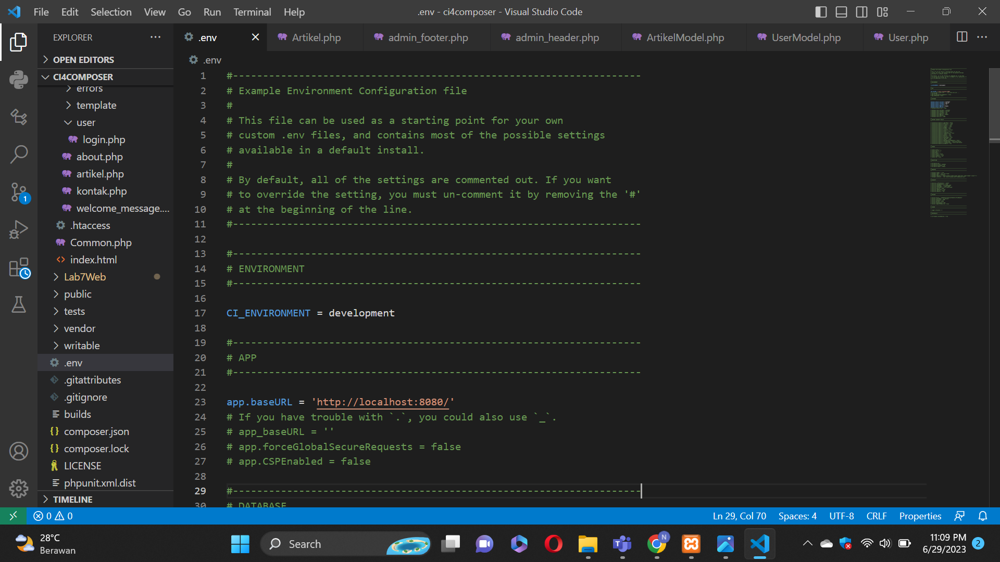

Untuk mengetahui route yang ditambahkan sudah benar, buka CLI (php spark routes)'
'
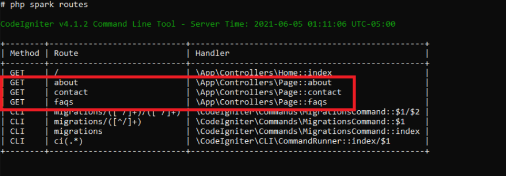

Selanjutnya adalah membuat Controller Page. Buat file baru dengan nama page.php pada direktori
Controller kemudian isi kodenya seperti berikut.'
'
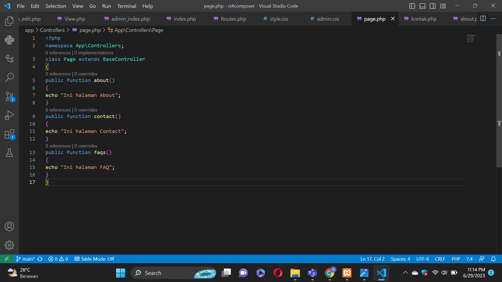
Ini adalah hasilnya'
'
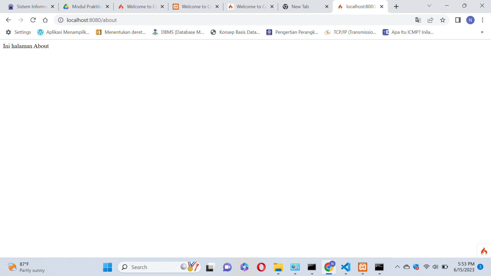

Secara default fitur autoroute pada Codeiginiter sudah aktif.'
'
Untuk mengubah status autoroute dapat mengubah nilai variabelnya. '
'
Untuk menonaktifkan ubah nilai true menjadi false.'
'
{$routes->setAutoRoute(true);} '
'
Tambahkan method baru pada Controller Page seperti berikut. '
'
public function tos()'
'
{'
'
echo "ini halaman Term of Services";'
'
}'
'
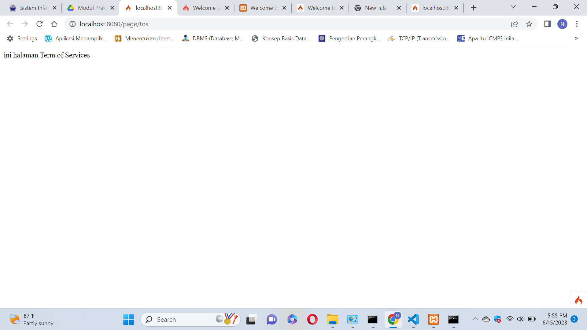

Selanjutnya adalam membuat view untuk tampilan web agar lebih menarik. Buat file baru dengan
nama about.php pada direktori view (app/view/about.php)'
'
Ubah method about pada class Controller Page menjadi seperti berikut:'
'
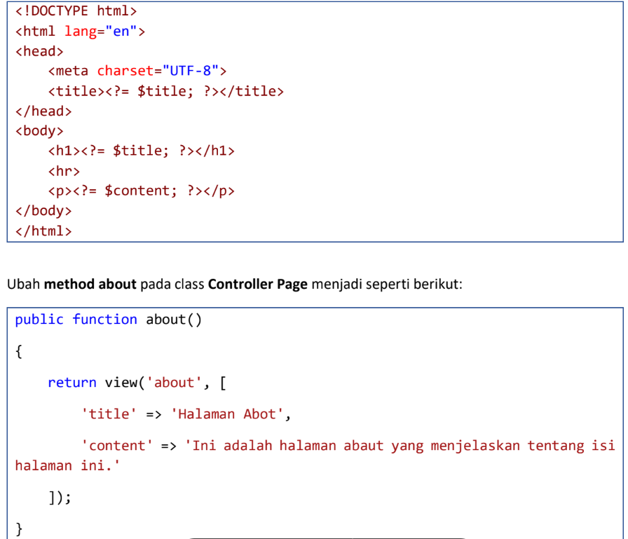
Ini adalah Hasilnya
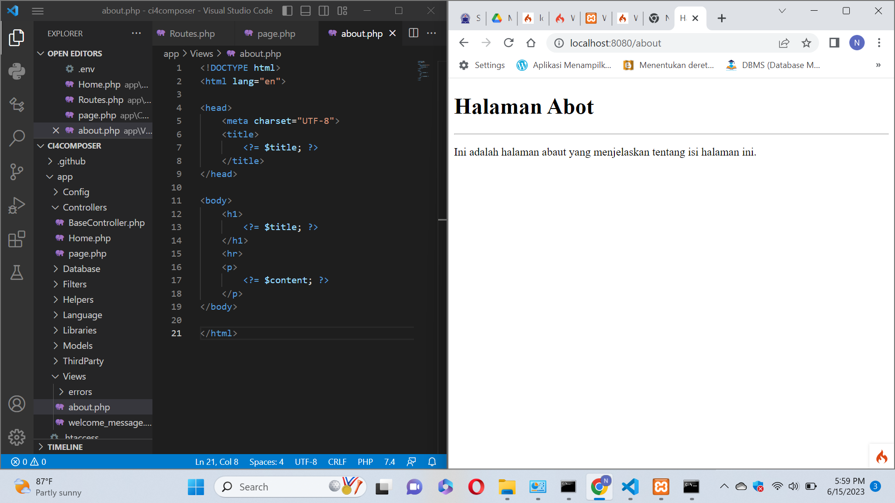

Buat file css pada direktori public dengan nama style.css'
'
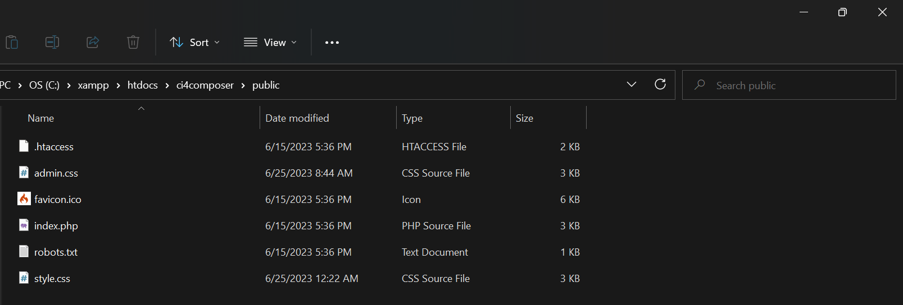

Kemudian buat folder template pada direktori view kemudian buat file header.php dan footer.php
File app/view/template/header.php'
'

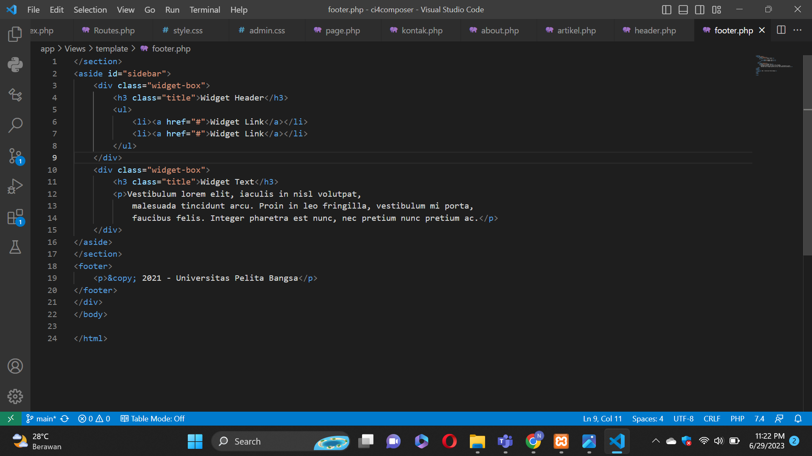

Selanjutnya refresh tampilan pada alamat http://localhost:8080/about '
'
Ini adalah hasilnya '
'
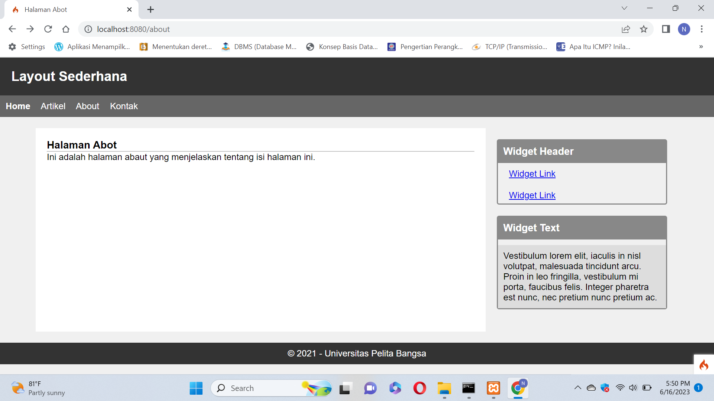

## LANGKAH LANGKAH PRAKTIKUM

1. Persiapan.
    Untuk memulai membuat aplikasi CRUD sederhana, yang perlu disiapkan adalah database server
    menggunakan MySQL. Pastikan MySQL Server sudah dapat dijalankan melalui XAMPP.
2. Membuat Database: Studi Kasus Data Artikel
    Masuk ke SQL, kemudian ketikkan seperti berikut
    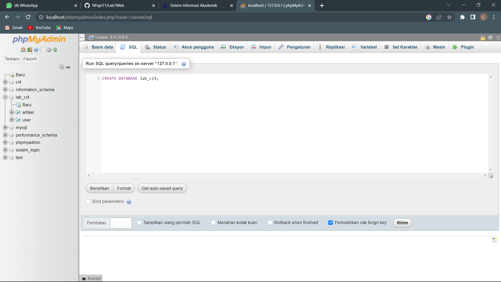
   
     kemudian buat tabel dengan dengan kode sql berikut
   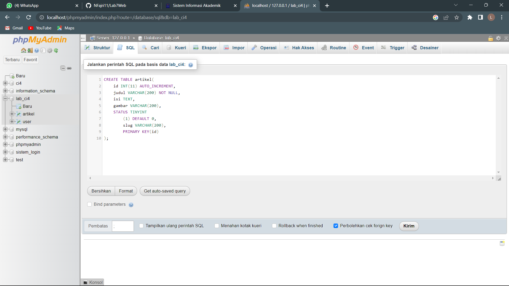
3. Konfigurasi databasenya pada file .env
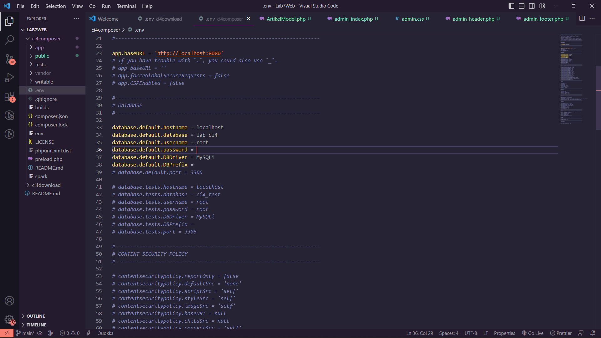
    
4. Membuat Model
    Selanjutnya adalah membuat Model untuk memproses data Artikel. Buat file baru pada direktori
app/Models dengan nama ArtikelModel.php
php
    <?php
    namespace App\Models;
    use CodeIgniter\Model;
    class ArtikelModel extends Model
    {
        protected $table = 'artikel';
        protected $primaryKey = 'id';
        protected $useAutoIncrement = true;
        protected $allowedFields = [
            'judul', 'isi', 'status', 'slug',
            'gambar'
        ];
        public function updateArtikel($id, $data)
        {
            $this->where('id', $id)->set($data)->update();
        }
    }

5. Membuat controller
    Buat Controller baru dengan nama Artikel.php pada direktori app/Controllers.
    php
        <?php

        namespace App\Controllers;

        use App\Models\ArtikelModel;
        use CodeIgniter\Exceptions\PageNotFoundException;

        class Artikel extends BaseController
        {
            public function index()
            {
                $title = 'Daftar Artikel';
                $model = new ArtikelModel();
                $artikel = $model->findAll();
                return view('artikel/index', compact('artikel', 'title'));
            }

            public function view($slug)
            {
                $model = new ArtikelModel();
                $artikel = $model->where('slug', $slug)->first();

                // Menampilkan error apabila data tidak ada.
                if (!$artikel) {
                    throw PageNotFoundException::forPageNotFound();
                }

                $title = $artikel['judul'];
                return view('artikel/detail', compact('artikel', 'title'));
            }

            public function admin_index()
            {
                $title = 'Daftar Artikel';
                $model = new ArtikelModel();
                $artikel = $model->findAll();
                return view('artikel/admin_index', compact('artikel', 'title'));
            }
            public function add()
            {
                // validasi data.
                $validation = \Config\Services::validation();
                $validation->setRules(['judul' => 'required']);
                $isDataValid = $validation->withRequest($this->request)->run();

                if ($isDataValid) {
                    $artikel = new ArtikelModel();
                    $artikel->insert([
                        'judul' => $this->request->getPost('judul'),
                        'isi' => $this->request->getPost('isi'),
                        'status' => 'Aktif',
                    ]);

                    return redirect()->to('admin/artikel');
                }

                $title = "Tambah Artikel";
                return view('artikel/form_add', compact('title'));
            }

            public function edit($id)
            {
                $artikel = new ArtikelModel();

                // validasi data
                $validation = \Config\Services::validation();
                $validation->setRules(['judul' => 'required']);

                $isDataValid = $validation->withRequest($this->request)->run();

                if ($isDataValid) {
                    $artikel->update($id, [
                        'judul' => $this->request->getPost('judul'),
                        'isi' => $this->request->getPost('isi'),
                    ]);

                    return redirect('admin/artikel');
                }

                // ambil data lama
                $data = $artikel->find($id);
                $title = "Edit Artikel";

                // Periksa apakah data ditemukan sebelum mengirimkan ke view
                if ($data === null) {
                    return redirect('admin/artikel');
                }

                return view('artikel/form_edit', compact('title', 'data'));
            }
            public function delete($id)
            {
                $artikel = new ArtikelModel();
                $artikel->delete($id);
                return redirect('admin/artikel');
            }
        }
    
6. Membuat View
Buat direktori baru dengan nama artikel pada direktori app/views, kemudian buat file baru dengan
nama index.php.
php
    <?= $this->include('template/header'); ?>
    <?php if($artikel): foreach($artikel as $row): ?>
    <article class="entry">
    <h3><a href="<?= base_url('/artikel/' . $row['slug']);?>"><?=
    $row['judul']; ?></a>
    </h3>

    " alt="<?=
    $row['judul']; ?>">
    
<?= substr($row['isi'], 0, 200); ?>

    </article>
     
    

     
    <?php endforeach; else: ?>
    <article class="entry">
    <h2>Belum ada data.</h2>
    </article>
    <?php endif; ?>
    <?= $this->include('template/footer'); ?>

  Lalu masuk lagi ke sql dan masukkan kode berikut 

 

Maka pada halaman artikel akan tampil seperti berikut

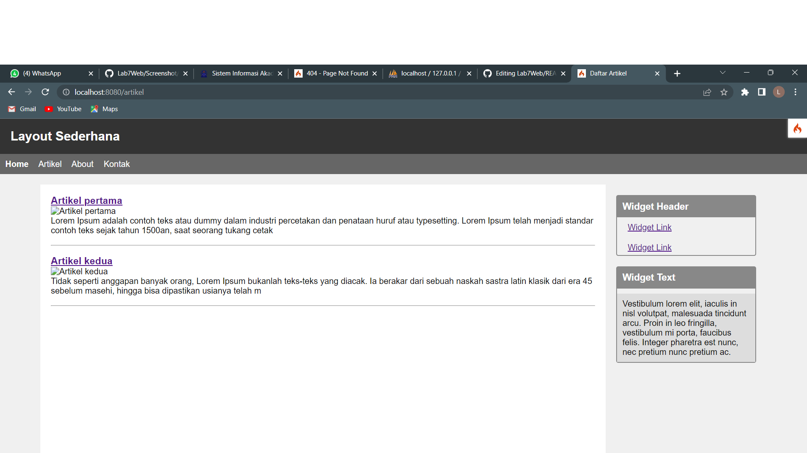
7. Membuat Tampilan Detail Artikel
Tampilan pada saat judul berita di klik maka akan diarahkan ke halaman yang berbeda. Tambahkan
fungsi baru pada Controller Artikel dengan nama view().
php
public function view($slug)
    {
        $model = new ArtikelModel();
        $artikel = $model->where('slug', $slug)->first();

        // Menampilkan error apabila data tidak ada.
        if (!$artikel) {
            throw PageNotFoundException::forPageNotFound();
        }

        $title = $artikel['judul'];
        return view('artikel/detail', compact('artikel', 'title'));
    }

Kemudian Buat view baru untuk halaman detail dengan nama app/views/artikel/detail.php.
php
<?= $this->include('template/header'); ?>
<article class="entry">
<h2><?= $artikel['judul']; ?></h2>
" alt="<?=
$artikel['judul']; ?>">

<?= $artikel['isi']; ?>

</article>
<?= $this->include('template/footer'); ?>

kemudian setting Routes nya seperti berikut
php
$routes->get('/artikel/(:any)', 'Artikel::view/$1');

Maka akan tampil seperti berikut

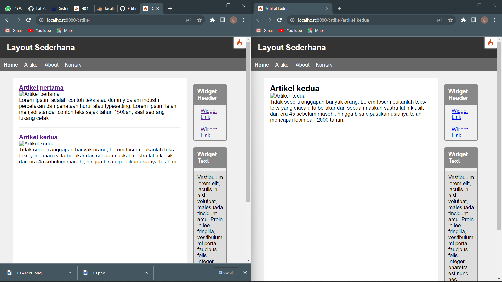

8. Membuat Menu Admin
Menu admin adalah untuk proses CRUD data artikel. Buat method baru pada Controller Artikel dengan
nama admin_index().
php
public function admin_index()
    {
        $title = 'Daftar Artikel';
        $model = new ArtikelModel();
        $artikel = $model->findAll();
        return view('artikel/admin_index', compact('artikel', 'title'));
    }

Selanjutnya buat view untuk tampilan admin dengan nama admin_index.php
php
<?= $this->include('template/admin_header'); ?>
<table class="table">
    <thead>
        <tr>
            <th>ID</th>
            <th>Judul</th>
            <th>Status</th>
            <th>Aksi</th>
        </tr>
    </thead>
    <tbody>
        <?php if ($artikel) : foreach ($artikel as $row) : ?>
                <tr>
                    <td><?= $row['id']; ?></td>
                    <td>
                        <b><?= $row['judul']; ?></b>
                        
<small><?= substr($row['isi'], 0, 50); ?></small>

                    </td>
                    <td><?= isset($row['status']) ? $row['status'] : 'Status tidak tersedia'; ?></td>
                    <td>
                        <a class="btn" href="<?= base_url('/admin/artikel/edit/' . $row['id']); ?>">Ubah</a>
                        <a class="btn btn-danger" onclick="return confirm('Yakin menghapus data?');" href="<?= base_url('/admin/artikel/delete/' . $row['id']); ?>">Hapus</a>
                    </td>
                </tr>
            <?php endforeach;
        else : ?>
            <tr>
                <td colspan="4">Belum ada data.</td>
            </tr>
        <?php endif; ?>
    </tbody>
    <tfoot>
        <tr>
            <th>ID</th>
            <th>Judul</th>
            <th>Status</th>
            <th>Aksi</th>
        </tr>
    </tfoot>
</table>
<?= $this->include('template/admin_footer'); ?>

Tambahkan routing untuk menu admin seperti berikut:
php
$routes->group('admin', function ($routes) {
    $routes->get('artikel', 'Artikel::admin_index');
    $routes->add('artikel/add', 'Artikel::add');
    $routes->add('artikel/edit/(:any)', 'Artikel::edit/$1');
    $routes->get('artikel/delete/(:any)', 'Artikel::delete/$1');
});

maka hasilnya seperti berikut
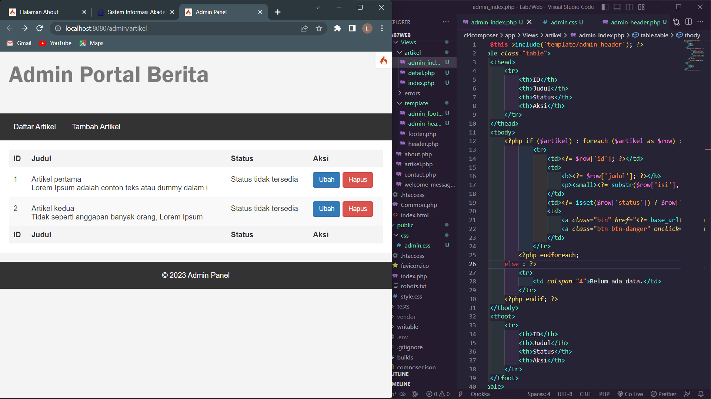

9. Membuat CRUD(Create Read Update Delete) data artikel
Tambahkan fungsi/method baru pada Controller Artikel seperti berikut
php
public function add()
    {
        // validasi data.
        $validation = \Config\Services::validation();
        $validation->setRules(['judul' => 'required']);
        $isDataValid = $validation->withRequest($this->request)->run();

        if ($isDataValid) {
            $artikel = new ArtikelModel();
            $artikel->insert([
                'judul' => $this->request->getPost('judul'),
                'isi' => $this->request->getPost('isi'),
                'status' => 'Aktif',
            ]);

            return redirect()->to('admin/artikel');
        }

        $title = "Tambah Artikel";
        return view('artikel/form_add', compact('title'));
    }

    public function edit($id)
    {
        $artikel = new ArtikelModel();

        // validasi data
        $validation = \Config\Services::validation();
        $validation->setRules(['judul' => 'required']);

        $isDataValid = $validation->withRequest($this->request)->run();

        if ($isDataValid) {
            $artikel->update($id, [
                'judul' => $this->request->getPost('judul'),
                'isi' => $this->request->getPost('isi'),
            ]);

            return redirect('admin/artikel');
        }

        // ambil data lama
        $data = $artikel->find($id);
        $title = "Edit Artikel";

        // Periksa apakah data ditemukan sebelum mengirimkan ke view
        if ($data === null) {
            return redirect('admin/artikel');
        }

        return view('artikel/form_edit', compact('title', 'data'));
    }
    public function delete($id)
    {
        $artikel = new ArtikelModel();
        $artikel->delete($id);
        return redirect('admin/artikel');
    }

Kemudian buat view untuk form tambah dengan nama form_add.php
php
<?= $this->include('template/admin_header'); ?>

<h2><?= $title; ?></h2>

<form action="" method="post">
     
    

        <label for="judul">Judul</label> 
        <input type="text" name="judul" id="judul" value="<?= old('judul'); ?>" onfocus="clearText(this)" style="width: 100%;">
    

    
 
        <label for="isi">Isi</label> 
        <textarea name="isi" id="isi" cols="50" rows="10" onfocus="clearText(this)" style="width: 100%;"></textarea>
    

    

        <input type="submit" value="Kirim" class="btn btn-large">
    

</form>

<?= $this->include('template/admin_footer'); ?>

Lalu buat view untuk form edit dengan nama form_edit.php
php
<?= $this->include('template/admin_header'); ?>
<h2><?= $title; ?></h2>
<form action="" method="post">
    

        <input type="text" name="judul" value="<?= $data['judul']; ?>">
    

    

        <textarea name="isi" cols="50" rows="10"><?= $data['isi']; ?></textarea>
    

    

        <input type="submit" value="Kirim" class="btn btn-large">
    

</form>
<?= $this->include('template/admin_footer'); ?>

   
Maka Hasilnya akan seperti ini:
.png)
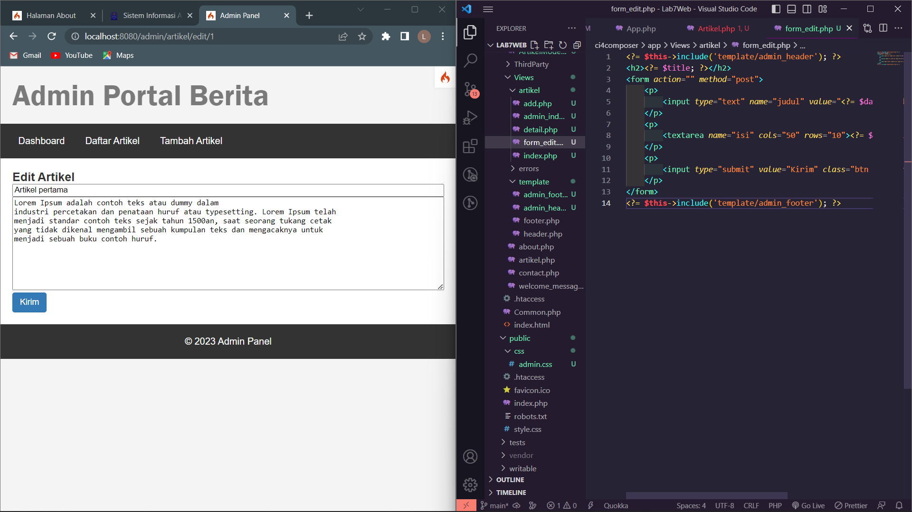